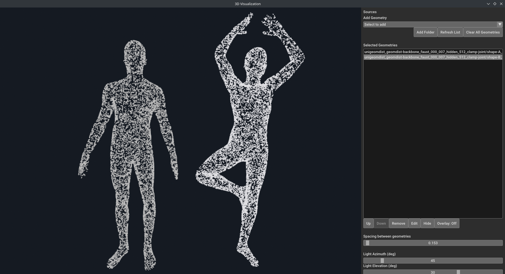

# 3D Visualization


Simple 3D visualizer for point clouds and meshes built with Open3D.

The tool was developed to support experiments with 3D geometry and point
correspondence visualization. It provides an interactive environment for
inspecting point clouds, meshes, and correspondence relationships.


## Technologies

- Python
- Open3D
- TriMesh
- NumPy

## Features

- Rendering of point clouds (PCD) and triangle meshes
- Interactive camera navigation
- Visual highlighting of point correspondences
- Visualization of additional point-level statistics

## Requirements

- Python 3.8+
- OpenGL-compatible graphics hardware
- Dependencies listed in `requirements.txt`

## Installation

1. Clone the repository
2. Install dependencies:
   ```bash
   pip install -r requirements.txt
   ```
3. Run the visualization application
   ```bash
   python run.py
   ```


## Project Structure

```
3DVisualization/
├── src/              # Source code
├── run.py            # Entry script
└── README.md         # This file
```

## License

This project was developed as part of a university thesis project and is
provided for research and educational purposes.

